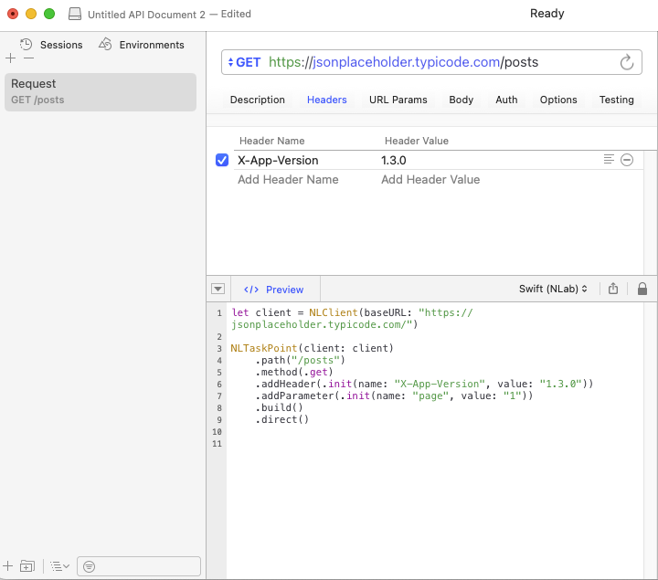

# NLab

[](https://travis-ci.org/yasinkbas/NLab)
[](https://cocoapods.org/pods/NLab)
[](https://cocoapods.org/pods/NLab)

> **NLab** is a modern, composable networking **SDK** for Swift. It brings a fluent, type-safe API on top of `URLSession`, making network code delightful to write, test and maintain on **iOS**, **macOS**, **tvOS** and **watchOS**.

---

## ✨ Features

| Category | Description |
| -------- | ----------- |
| 🏗 **Fluent Builder** | Chainable DSL to describe requests in a single, readable line. |
| 🛡 **Middleware** | Plug-in error, logger, metrics or caching layers. |
| 🔒 **Authentication** | Basic, Bearer token or custom auth out-of-the-box. |
| 📦 **Content-Type aware** | JSON, XML, form-data and 80+ MIME types supported. |
| 🚦 **Director Pattern** | Declarative `start()` + `async` execution with fine-grained callbacks. |
| ⚙️ **Options** | Reusable behaviours like *cancelOtherRequests*. |
| 🖨 **Pretty Logging** | Curl-style request + formatted JSON response dumps. |
| 🧪 **Testability** | Pure Swift, dependency-injectable, XCTest-friendly. |

---

## 📚 Table of Contents

1. [Requirements](#requirements)
2. [Installation](#installation)
3. [Architecture](#architecture)
   1. [NLClient](#nlclient)
   2. [NLTaskPoint](#nltaskpoint)
   3. [NLTaskRoute](#nltaskroute)
   4. [Director](#director)
   5. [Middleware](#middleware)
   6. [Authentication](#authentication)
   7. [Options](#options)
   8. [Models](#models)
   9. [Content Types](#content-types)
   10. [Logging](#logging)
4. [Quick Start](#quick-start)
5. [Detailed Examples](#detailed-examples)
6. [Best Practices](#best-practices)
7. [Example Project](#example-project)
8. [Paw Extension](#paw-extension)
9. [Contributing](#contributing)
10. [License](#license)

---

## 📋 Requirements

* Swift **5.5**+
* iOS **11**+ / macOS **10.11**+
* Xcode **13**+

---

## 📦 Installation

### Swift Package Manager (Preferred)

```swift
.package(url: "https://github.com/yasinkbas/NLab.git", from: "1.3.0")
```

### CocoaPods (not supported anymore, latest version 1.1.3)

```ruby
pod 'NLab'
```

---

## 🏛 Architecture

NLab is built around **five primary abstractions**:

```txt
┌─────────┐   build()   ┌──────────┐   direct()   ┌─────────-──┐   start()   ┌────────────┐
│ Point   │──────-─────▶│ Route    │─────────-───▶│ Director   │──────────-─▶│ URLSession │
└─────────┘             └──────────┘              └-───────────┘             └────────────┘
     ▲                        ▲                          ▲
     │                        │                          │
     │           created by   │              uses        │
     │                        │                          │
┌─────────┐            ┌──────────┐               ┌────────────┐
│ Client  │─────-─────▶│  Models  │◀───────────-──│ Middleware │
└─────────┘            └──────────┘               └────────────┘
```

### NLClient

The **entry point** that knows your `baseURL`, owns the `URLSession`, optional `Authentication` strategy and shared behaviours.

```swift
let client = NLClient(
    baseURL: URL(string: "https://api.example.com")!,
    authentication: BearerAuth.self // optional
)

// Custom session configuration
let configuration = URLSessionConfiguration.default
configuration.timeoutIntervalForRequest = 15
let customClient = NLClient(baseURL: "https://api.example.com", configuration: configuration)
```

### NLTaskPoint

A **fluent builder** that describes *what* you want to call. Think of it as `URLComponents` + request metadata.

```swift
let point = NLTaskPoint<Post.Response, Empty>(client: client)
    .path("posts/1")
    .method(.get)
    .header(CustomHeaders())
    .addParameter(.init(name: "preview", value: "true"))
    .content(.json)
    .middleware(ErrorHandler.self)
    .addOptions([.cancelOtherRequests])
```

### NLTaskRoute

A **value object** generated by `point.build()` that can be stored, mutated or reused later.

```swift
let route = point.build()
// You can store route and trigger it later
let director = route.direct()
director.start()
```

### Director

`NLTaskDirector` (wrapper of generic `HTTPDirector`) **executes** the request and delivers results.

```swift
let director = NLTaskPoint(client: client)
    .path("posts")
    .method(.get)
    .build()
    .direct()

// Classic closure style
 director
    .onData { (posts: [Post.Response]) in print(posts) }
    .onError { print("❌", $0) }
    .onResponse { print("Status", $0) }
    .start()

// and if you want u can use startAsync(iOS 15+) easily instead of start() without onData/onError/onResponse calls.
 director
    ...
    ...
    .startAsync()
```

### Middleware

Conform to `ErrorMiddleware` (or create your own protocols) to intercept failures **before** they propagate.

```swift
class ErrorHandler: ErrorMiddleware {
    static func onError(_ error: Error) -> Error {
        // good area to map | log | retry
        print("🛑", error)
        return error
    }
}
```

Attach it via `.middleware(ErrorHandler.self)` on any `Point` or `Route`.

### Authentication

Any type can become an auth provider by conforming to `NLAuthentication` *marker* protocol.

```swift
struct BearerAuth: NLAccessTokenAuthentication {
    static var accessKey: String = "Authorization"
}
```

Supply it to a **Client** (applies globally) or a single **Point**/ **Route**:

```swift
NLTaskPoint(client: client)
    .authentication(BearerAuth.self)
```

### Options

`NLClientOption` encapsulates *behaviours*. Built-in: `.cancelOtherRequests`.

```swift
point.addOptions([.cancelOtherRequests])
```

Creating your own option:

```swift
extension NLClientOption {
    static func timeout(_ interval: TimeInterval) -> Self {
        .custom { client in
            client.session.configuration.timeoutIntervalForRequest = interval
        }
    }
}
```

### Models

A tiny set of protocols to keep your DTOs clear.

```swift
struct CreatePost: NLRequestModel {
    struct Request: Encodable { let title, body: String }
}

struct Post: NLResponseModel {
    struct Response: Decodable { let id: Int; let title, body: String }
}

// or contain both in one model
struct Post: NLComprehensiveModel {
   struct Request: Encodable { let title, body: String }
   struct Response: Decodable { let id: Int; let title, body: String }
}

```

### Content Types
Default is **application/json** which enum case is **.json**. If you use json for content you don't have to set it.
Change the `Content-Type` in one line:

```swift
.content(.xml)
```

### Logging

Enabled by default – prints a **curl-style request** and **pretty-printed JSON** response. Silence it by creating your own `HTTPClient` without `HTTPCLientLogging` conformance.

---

## 🚀 Quick Start

```swift
struct Post: NLResponseModel {
    struct Response: Decodable { let id: Int; let title, body: String }
}

let client = NLClient(baseURL: "https://jsonplaceholder.typicode.com")

NLTaskPoint(client: client)
    .path("posts/1")
    .method(.get)
    .onData { print($0.title) }
    .build()
    .direct()
    .start()
```

---

## 🧩 Detailed Examples

### 1. Creating a Client

```swift
let client = NLClient(baseURL: "https://api.myapp.com")
```

### 2. Defining Request & Response Models

```swift
struct Login: NLComprehensiveModel {
    struct Request: Encodable { let email, password: String }
    struct Response: Decodable { let token: String }
}
```

### 3. POST with Body

```swift
NLTaskPoint<Login.Response, Login.Request>(client: client)
    .path("auth/login/")
    .method(.post)
    .body(Login.Request(email: "a@b.com", password: "***"))
    .build()
    .direct()
    .onData { print("Token ->", $0.token) }
    .start()
```

### 4. Error Middleware in Action

```swift
NLTaskPoint(client: client)
    .path("posts/0") // invalid id to trigger 404
    .method(.get)
    .middleware(ErrorHandler.self)
    .build()
    .direct()
    .onError { print("Handled by middleware:", $0) }
    .start()
```

### 5. Authentication per Request

```swift
NLTaskPoint(client: client)
    .path("protected")
    .method(.get)
    .authentication(BearerAuth.self)
    .build()
    .direct()
    .start()
```

### 6. Custom Headers & Query Params

```swift
NLTaskPoint(client: client)
    .path("search")
    .addParameter(.init(name: "q", value: "nlab"))
    .header(CustomHeaders())
    .build()
    .direct()
    .start()
```

### 7. Cancel Other Requests

```swift
NLTaskPoint(client: client)
    .path("heavy/task")
    .addOptions([.cancelOtherRequests])
    .build()
    .direct()
    .start()
```

### 8. Async / Await

```swift
@available(iOS 15, *)
func fetchPosts() async {
    let posts: [Post.Response]? = await NLTaskPoint(client: client)
        .path("posts")
        .method(.get)
        .build()
        .direct()
        .startAsync()
    print(posts?.count ?? 0)
}
```

### 9. Custom `URLSession` Configuration

```swift
let configuration = URLSessionConfiguration.ephemeral
configuration.waitsForConnectivity = true

NLTaskPoint(client: customClient)
    .configure { $0.allowsCellularAccess = false }
    .path("posts")
    .build()
    .direct()
    .start()
```

### 10. Extend `NLContentType`

```swift
.content(.custom("application/custom"))
```

---

## 💡 Best Practices

NLab is intentionally lightweight and unopinionated, yet over time a set of idioms emerged that make codebases more predictable, testable and fun to work with. The list below is distilled from real-world projects.

### 1. One `NLClient` per base URL (and environment)
Create **exactly one** client instance per API surface (e.g. staging vs. production) and inject it where needed instead of scattering base-url strings around the codebase.

```swift
enum Environment {
    case staging, production

    var client: NLClient {
        switch self {
        case .staging:     return NLClient(baseURL: "https://staging.api.com")
        case .production:   return NLClient(baseURL: "https://api.com")
        }
    }
}
```

### 2. Group calls in `Endpoint` namespaces
Instead of building the request inline in view-models, expose tiny factories that return a ready-to-start `NLTaskDirector`:

```swift
struct AuthEndpoint {
    static func login(email: String, password: String) -> NLTaskDirector<Login.Response, Login.Request> {
        NLTaskPoint(client: Environment.production.client)
            .path("auth/login/")
            .method(.post)
            .body(Login.Request(email: email, password: password))
            .content(.json)
            .build().direct()
    }
}
```

### 3. Use Middleware for cross-cutting concerns
*Global* behaviours such as error mapping, logging, retry or metrics belong to middleware. Keep them pure and stateless so they are easy to test.

```swift
class ErrorMapper: ErrorMiddleware {
    static func onError(_ error: Error) -> Error {
        guard case let HTTPError.status(code, data) = error else { return error }
        switch code {
        case 401: return AuthError.unauthorized
        case 404: return APIError.notFound
        default:  return APIError.generic(code: code, data: data)
        }
    }
}
```

Attach it once to the `NLClient` *or* per `NLTaskPoint` when scoping is required.

### 4. Embrace Swift Concurrency
For iOS 15+ prefer `startAsync()` – the result is immediately *awaitable* and automatically runs on a background context.

```swift
let posts: [Post.Response] = try await NLTaskPoint(client: client)
    .path("posts")
    .method(.get)
    .build().direct()
    .startAsync()
```

### 5. Keep DTOs thin & expressive
Split `Request` / `Response` inside a single `NLComprehensiveModel` or separate `NLRequestModel` & `NLResponseModel` as needed. They live right next to the endpoint, not buried in a generic *Models* folder.

### 6. Turn recurring tweaks into `NLClientOption`s
If you find yourself repeatedly touching `URLSessionConfiguration` or headers, wrap it in an option:

```swift
extension NLClientOption {
    static func timeout(_ interval: TimeInterval) -> Self {
        .custom { $0.session.configuration.timeoutIntervalForRequest = interval }
    }
}

client.addOptions([.timeout(10)])
```

### 7. Testing strategy
• Swap `URLSession` for a stubbed `URLProtocol` or inject a custom `HTTPClient` that returns fixtures.  
• Keep middleware pure to unit-test error mapping in isolation.  
• Use `Task {}` + `await` inside tests to fully leverage Swift Concurrency.

```swift
final class StubbedHTTPClient: HTTPClient, HTTPClientLogging {
    // returns canned responses immediately
}
```

---

## 📦 Example Project

Open **`Example/Example.xcodeproj`** and run – it showcases the snippets above.

---

## ⚒️ Paw Extension
If you’re using RapidAPI(aka Paw), this extension makes it easy to quickly implement and create a director.

[NLab-PawCodeGenerator](https://github.com/yasinkbas/NLab-PawCodeGenerator)



---

## 🤝 Contributing

1. Fork the repo
2. Create a branch (`git checkout -b feature/myFeature`)
3. Commit your changes (`git commit -m 'Add myFeature'`)
4. Push to the branch (`git push origin feature/myFeature`)
5. Open a Pull Request

---

## 📄 License

NLab is released under the [MIT](LICENSE) license.

---

## 🙏 Acknowledgements

*Inspired by modern networking libraries such as Alamofire, Moya & Apollo. Built with ❤️ in Swift.*
